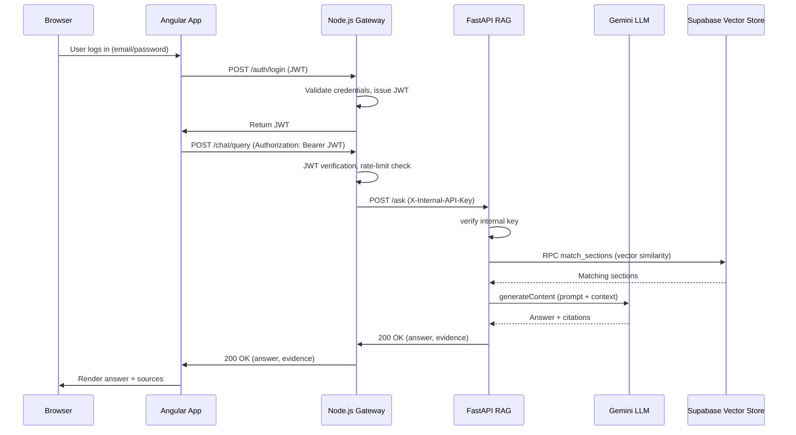

# PostpartumRAG 📚

> **Evidence‑grounded Retrieval‑Augmented Generation (RAG) for postpartum mental‑health support**

---

## Table of Contents
1. [Project Overview](#project-overview)
2. [Architecture Diagram](#architecture-diagram)
3. [Data Flow & Sequence Diagram](#data-flow--sequence-diagram)
4. [Tech Stack](#tech-stack)
5. [Getting Started (Local Development)](#getting-started-local-development)
6. [Environment Variables & Secrets](#environment-variables--secrets)
7. [Security Controls](#security-controls)
8. [Running the Security Test Suite](#running-the-security-test-suite)
9. [Deployment Guide (Render)](#deployment-guide-render)
10. [Contributing](#contributing)
11. [License](#license)

---

## Project Overview
PostpartumRAG is a **clinical‑grade, evidence‑grounded chatbot** that assists new parents with postpartum mental‑health questions. It stitches together three tightly coupled services:
- **Angular Front‑end** (`src/`)
- **Node.js/Express API Gateway** (`server/`)
- **FastAPI RAG Engine** (`maternal_health_rag/`)

The gateway enforces **zero‑trust authentication** between the front‑end and the RAG engine, preventing any direct external access to the Python service.

---

## Architecture Diagram
```mermaid
flowchart LR
    subgraph FrontEnd[Angular Front‑end]
        A[Browser] --> B[Angular App]
    end
    subgraph Gateway[Node.js API Gateway]
        C[Express Server] --> D[Auth Middleware]
        D --> E[Rate‑Limiter]
        E --> F[Chat Controller]
        F --> G[Chat Service]
        G --> H[FastAPI RAG (internal)]
    end
    subgraph RAG[FastAPI RAG Engine]
        H --> I[Authentication Dependency]
        I --> J[Gemini LLM]
        I --> K[Supabase Vector Store]
        J --> L[Answer Generation]
        K --> L
        L --> M[FastAPI Response]
    end
    B -->|HTTP (JWT) | C
    G -->|POST /ask (X‑Internal‑API‑Key) | H
    style FrontEnd fill:#E3F2FD,stroke:#90CAF9,stroke-width:2px
    style Gateway fill:#FFF3E0,stroke:#FFB74D,stroke-width:2px
    style RAG fill:#E8F5E9,stroke:#66BB6A,stroke-width:2px
```
*(The diagram above mirrors the visual you provided on the Miro board – feel free to replace it with a higher‑resolution PNG exported from Miro.)*

---

## Data Flow & Sequence Diagram

---

## Tech Stack
| Layer | Technology | Reasoning |
|-------|------------|-----------|
| **Front‑end** | Angular 17 (stand‑alone components, SCSS) | Modern, component‑driven UI with strong typing via TypeScript |
| **API Gateway** | Node.js 18 + Express 4.19 | Easy JWT handling, `express-rate-limit`, custom middleware, fast dev cycle |
| **RAG Engine** | Python 3.11 + FastAPI 0.115 | High‑performance async API, automatic OpenAPI docs, easy dependency injection |
| **LLM** | Google Gemini 3.6‑flash (via REST) | State‑of‑the‑art generation, token‑efficient |
| **Vector Store** | Supabase (PostgreSQL + pgvector) | Managed, server‑less, easy integration |
| **Database** | MongoDB Atlas (users, sessions, messages) | Flexible schema for chat history |
| **Testing** | Custom `security_tests.py` (Python) + Jest (Node) | End‑to‑end security regression suite |
| **CI/CD** | GitHub Actions → Render (Docker) | Automated builds & zero‑downtime deployments |

---

## Getting Started (Local Development)
> **Prerequisites**: Node ≥18, Python ≥3.11, Docker (optional), `uvicorn`, `npm`.

1. **Clone the repo**
   ```bash
   git clone https://github.com/khalaf-droid/PostpartumRAG.git
   cd PostpartumRAG
   ```
2. **Install Front‑end dependencies**
   ```bash
   npm install   # installs Angular CLI & lib deps
   ng serve      # runs dev server on http://localhost:4200
   ```
3. **Setup the Node.js backend**
   ```bash
   cd server
   npm install
   cp .env.example .env   # then edit values (see env section below)
   npm run dev            # runs on http://localhost:3000
   ```
4. **Setup the FastAPI RAG engine**
   ```bash
   cd ../maternal_health_rag
   python -m venv venv
   source venv/bin/activate   # Windows: venv\Scripts\activate
   pip install -r requirements.txt
   cp .env.example .env
   uvicorn app:app --reload   # runs on http://127.0.0.1:8000
   ```
5. **Create a test user** (via the front‑end or directly using the `/auth/register` endpoint).
6. **Open the UI** – navigate to `http://localhost:4200` and start chatting!

---

## Environment Variables & Secrets
All secrets are stored in **`.env`** files and **must never be committed**.

### Node.js (`server/.env`)
```dotenv
NODE_ENV=development
PORT=3000
MONGODB_URI=<your‑atlas‑uri>
JWT_ACCESS_SECRET=<64‑byte‑hex>
JWT_REFRESH_SECRET=<64‑byte‑hex>
JWT_ACCESS_EXPIRY=15m
JWT_REFRESH_EXPIRY=7d
CLIENT_URL=http://localhost:4200
RAG_API_URL=http://127.0.0.1:8000/ask
INTERNAL_API_KEY="postpartum12345"   # matches Python env
```
### FastAPI (`maternal_health_rag/.env`)
```dotenv
GEMINI_API_KEY=<your‑gemini‑key>
SUPABASE_URL=https://<project>.supabase.co
SUPABASE_KEY=<public‑service‑key>
ALLOWED_ORIGINS=http://localhost:3000,http://localhost:4200,http://127.0.0.1:4200
INTERNAL_API_KEY="postpartum12345"
TEST_MODE=true   # Enables deterministic mock for CI runs
```
> **Important** – Always keep the `INTERNAL_API_KEY` identical across both services; it is the secret that guarantees **zero‑trust** communication.

---

## Security Controls (Zero‑Trust)
| Layer | Control | Description |
|-------|---------|-------------|
| **API Gateway** | **JWT Authentication** | `Authorization: Bearer <token>` required for all `/api/*` routes.
| **API Gateway** | **Rate Limiting** | `express-rate-limit` per IP, with `trust proxy` enabled for Render.
| **Gateway ↔ RAG** | **Shared Internal API Key** | Header `X‑Internal‑API‑Key` validated by FastAPI; never exposed to front‑end.
| **FastAPI** | **CORS Hardened** | Only `localhost` origins allowed; all other origins receive `401`.
| **FastAPI** | **Exception Masking** | Operational errors return user‑friendly messages; internal stack traces never leaked.
| **Input Validation** | **Zod (Node) + Pydantic (FastAPI)** | Sanitizes questions, blocks NoSQL operators, and enforces length ≤2000 chars.
| **Prompt Injection** | **Regex filters** | Detects “ignore previous instructions”, “system:” etc.
| **Storage** | **JWT stored in HttpOnly cookie (future)** | Currently in localStorage for dev; plan to migrate to HttpOnly for production.
| **Logging** | **Structured JSON logs** | All unexpected errors are logged server‑side with timestamps.

---

## Running the Security Test Suite
The suite (`security_tests.py`) spawns both servers in **TEST** mode and validates every security guarantee.
```bash
python security_tests.py
```
Expected outcome (all ✅):
- Direct FastAPI access without/with invalid key → 401/403
- Rate‑limiter IP isolation ✅
- Mass‑assignment, NoSQL‑injection, Prompt‑Injection, Payload‑size ✅
- Node ↔ FastAPI successful request → 200
- Front‑end spoof‑attempt on internal key ignored ✅

> **Tip** – When adding new endpoints, extend the test suite to maintain coverage.

---

## Deployment Guide (Render) 
1. **Create two Render services**
   - **Web Service** → `server/` (Node.js). Set `Build Command: npm install && npm run build` and `Start Command: npm run dev`.
   - **Background Worker** → `maternal_health_rag/` (Python). Use Dockerfile or the built‑in Python build. Set `Start Command: uvicorn app:app --host 0.0.0.0 --port 8000`.
2. **Environment Variables** – Add all values from the `.env` files (Render will mask them).
3. **Static Assets** – Angular build output (`dist/`) can be served via a CDN or Render static site.
4. **Health Checks** – `/health` endpoint on Node.js is used by Render for liveness.
5. **Scaling** – Both services are stateless; you can increase instance count without code changes.

---

## Contributing
1. Fork the repository.
2. Create a feature branch (`git checkout -b feat/awesome‑feature`).
3. Follow the **code‑style guidelines** – Prettier for JS/TS, Black for Python.
4. Run tests locally (`npm test` & `pytest`).
5. Submit a Pull Request with a clear description and updated `README` if you add new functionality.

---

## License
This project is licensed under the **MIT License** – see the `LICENSE` file for details.

---

#### 🎨 Visual Assets
- The mermaid diagrams above can be exported as PNG/SVG for the final README.
### 📊 Miro Board Diagrams

#### Full System Architecture (Top)


#### Full System Architecture (Bottom)


#### RAG Serving Pipeline (Top)


#### Data Preparation & Ingestion Pipeline


#### Query & Ingestion Flowcharts (Top)


#### Testing & Evaluation


> All diagrams were captured from the shared Miro board and saved as high‑resolution PNGs. Feel free to copy them into an `assets/` folder for a cleaner repository layout.

*Happy coding and thank you for contributing to safer AI‑driven healthcare!*
